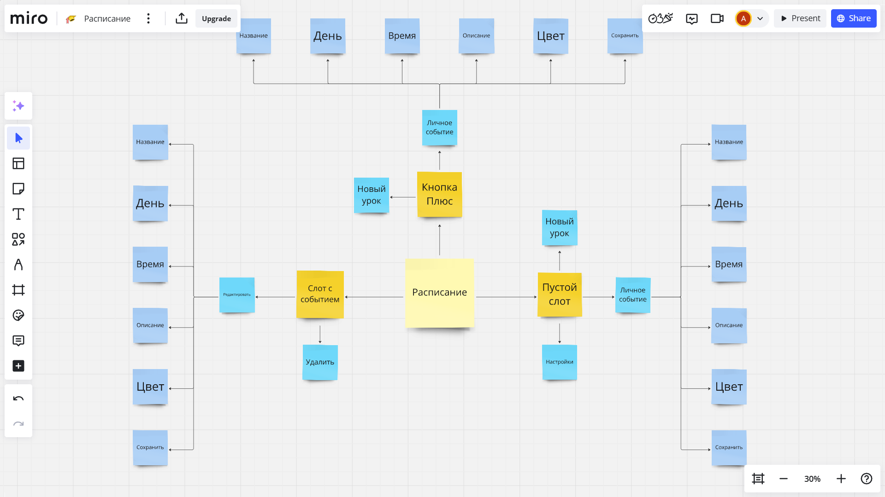
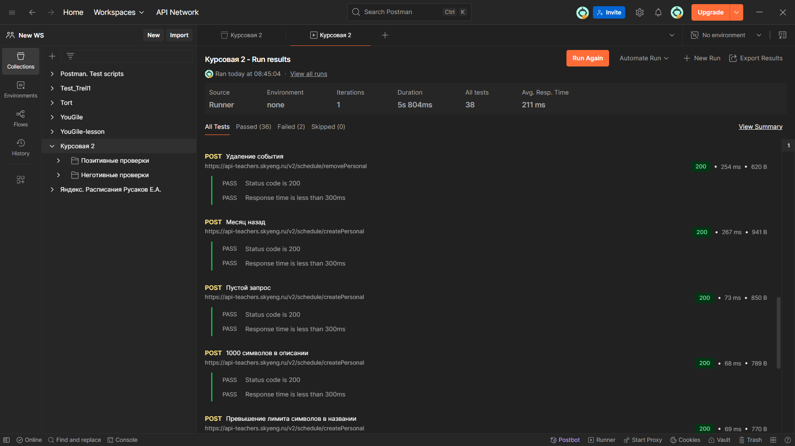
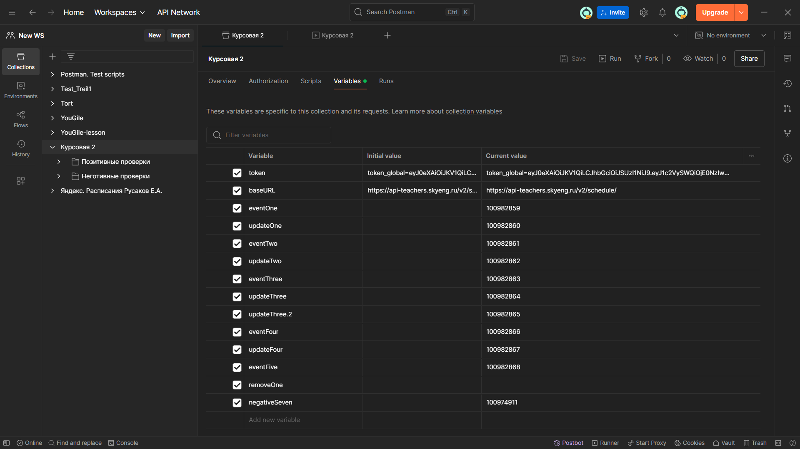
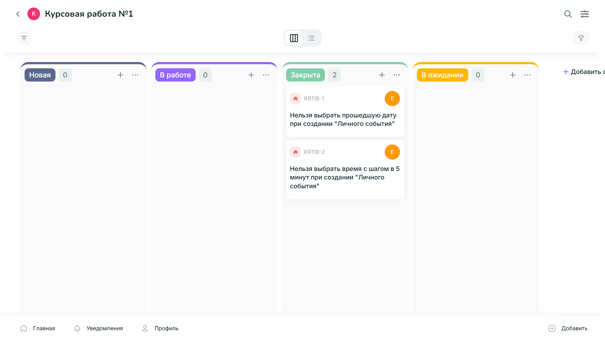
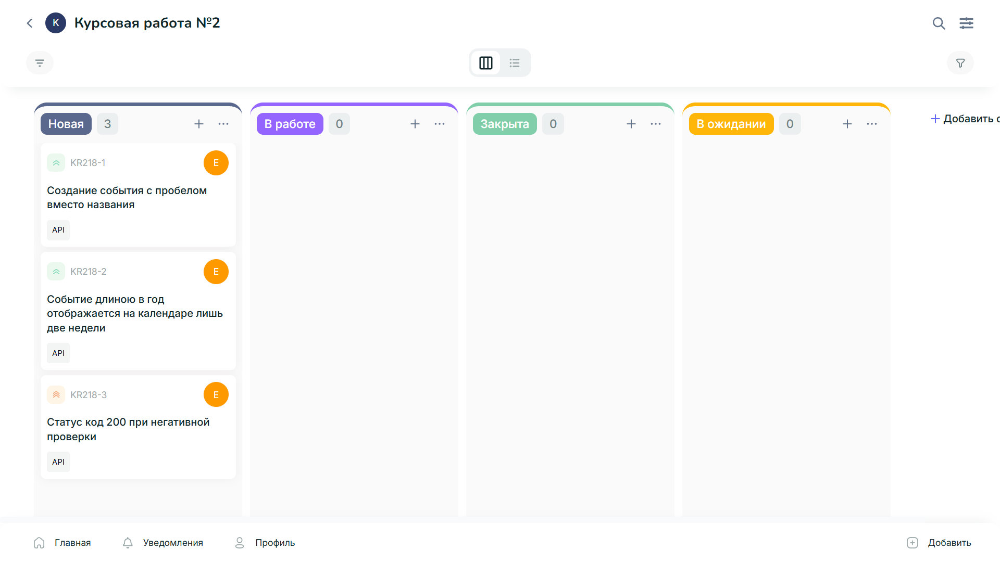
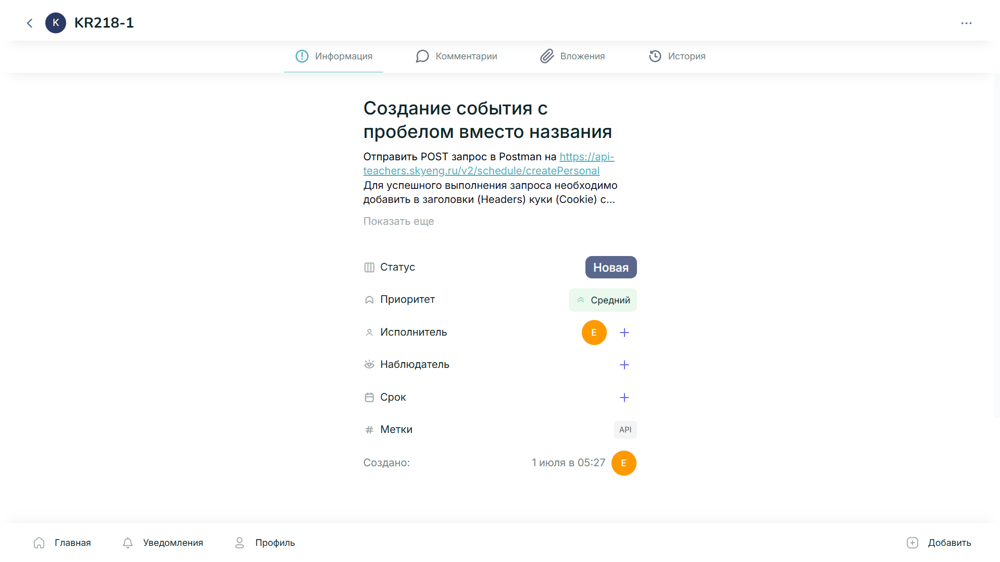
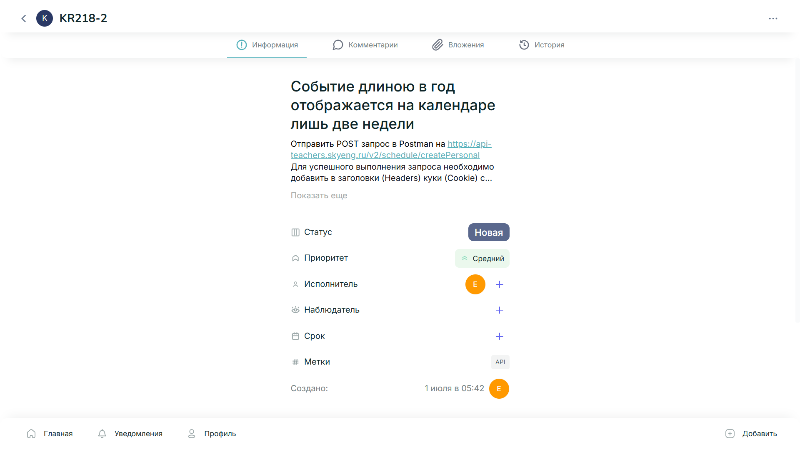
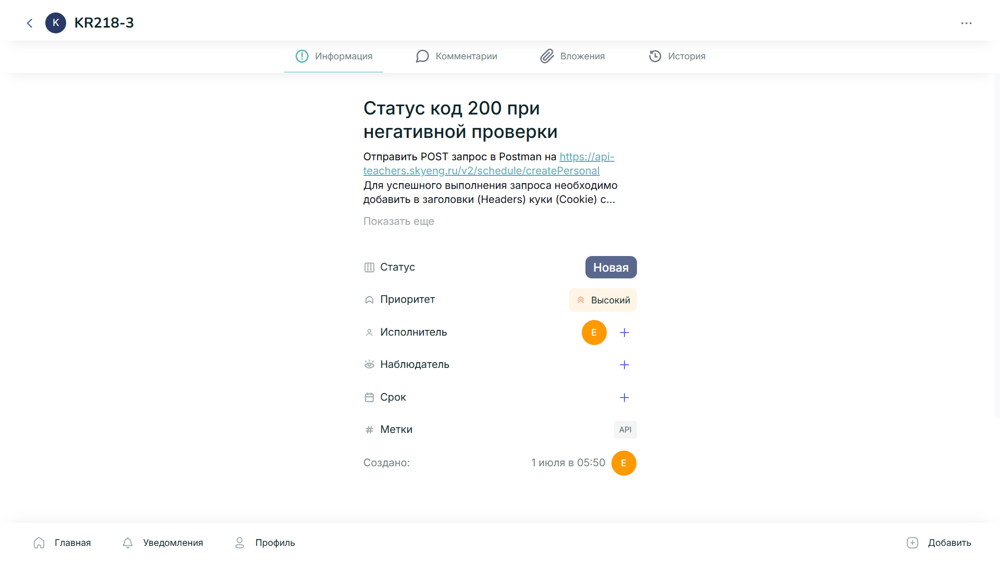

# Отчет о тестировании итогового проекта

## Время выполнения Курсовой работы составило 24 часа

## Цели работы: 

- Проверка новой функциональности “Личные события”
- Принятие решения о готовности выпуска исследуемой функциональности
- Предложить рекомендации
- Проверка требований

## В ходе работы было сделано:

### 1. Знакомство с Требованиями и по ним были написаны вопросы для уточнения.

### 2. Выполнена декомпозиция тестируемой функциональности:

### 3. Применены следующие виды тестирования:

#### Smoke-тест-кейсы:

[Открыть PDF](https://disk.yandex.ru/i/Gkyxm1rED7mQGg)

#### Функциональный чек-лист:
[Открыть PDF](https://disk.yandex.ru/i/MidnGi6RVv742g)

#### Регрессионный чек-лист:
[Открыть PDF](https://disk.yandex.ru/i/_Yu1ZXiH1cSNbA)
 

#### Приемочные тест-кейсы:
[Открыть PDF](https://disk.yandex.ru/i/t-WP51Rah22bqA)

#### API тест-кейсы:
Позитивные API тест-кейсы
[Открыть PDF](https://disk.yandex.ru/i/ovldCMv7AaKCiw)

Неготитивные API тест-кейсы
[Открыть PDF](https://disk.yandex.ru/i/kRdFMBimyqQ3Aw)

### 4. Была создана коллекция в Postman и проведен тест-ран

На тестирование API было потрачено 5  часов, сам тест ран проходит меньше чем за минуту.

API тест кейсы созданные таким образом, что должны проверяться последовательно. Использовались техники: Граничных значений, что позволило протестировать границы параметров “Название“, “Дата и Время“, “Цвет“ и Попарного тестирования, что в свою очередь дало возможность менять все параметры “Личного события” в каждом тест-кейсе. Таким образом за минимальное количество кейсов удалось проверить новую функциональность.

C помощью API мы можем менять параметры, которые не можем изменить на самой странице, цвет, дату и время…

### 5. В ходе выполнения тест рана были закрыты два ранее созданные **“UI”** баги. 

### 6. А также выявлено три новых “UI“ бага, при тестировании API.

### 7. Составлен тест-план.

### 8. Выводы по проделанной работе:

- Проверка исследуемой функциональности - проведена успешна.
- В результате тестирования новая функциональность “Личные события” является готовой к выпуску. Требования всех стейкхолдеров удовлетворены. При тестировании API были обнаружены три Незначительных “UI“ бага.
- По моему мнению, помимо исправления заведенных багов, в функциональности не хватает:
Добавить дополнительных цветов для окрашивания событий, т.к. четыре имеющихся цвета может быть не достаточно, для полного разделения чего либо преподавателями.

### 9. Вопросы к требованиям

1. Требование:
Преподаватель может добавить личное событие двумя способами:

- кликнуть на слот,
- нажать на плюс.

Вопрос:
- При клике на слот или нажатие на плюс, необходимо выбрать Личное событие. Или я могу добавить то, что выбрано в меню и это будет считаться личным событием?

2. Требование:
Название — обязательный параметр, не длиннее 40 символов.

Вопрос:
- Каких символов? 
- Могу поставить 40 смайлов?

3. Требование:
Описание — необязательно для заполнения, нет ограничения по символам.

Вопрос:
- Нет ограничения по символам?
- Могу написать 10000 символов?

4. Требование:
Цвет события — по умолчанию серый.

Вопрос:
- На макете представлено 4 цвета, можно ли использовать больше и как?

5. Требование:
При редактировании можно изменить:

- название,
- цвет,
- описание,
- время.

Вопрос:
- Могу ли изменить дату?

6. Требование:
Если событие и урок совпадают по времени, урок всегда отображается выше всего.

Вопрос:
- Сколько уроков и событий можно уместить в одно время?

7. Требование:
Преподает сразу в нескольких школах (трех). Очень важно чтобы в ее расписании она сразу
могла увидеть наглядно, какой ученик из какой школы придет.

Вопрос:
- Нужны ли конкретные цвета и для школ, и для учеников? 
- Или достаточно только для школы?