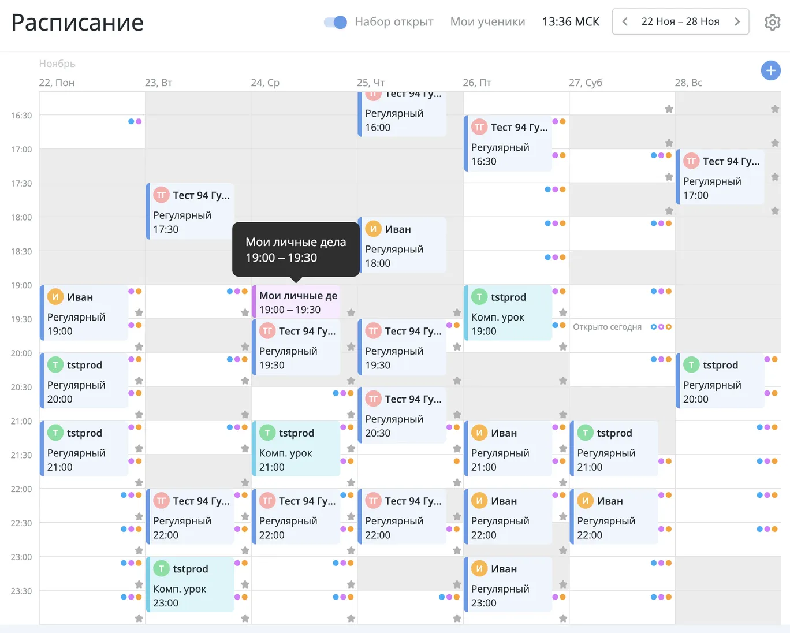
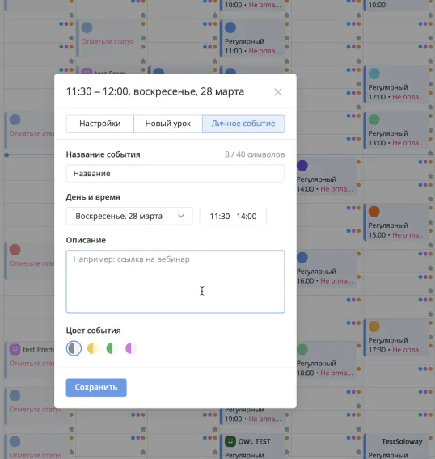
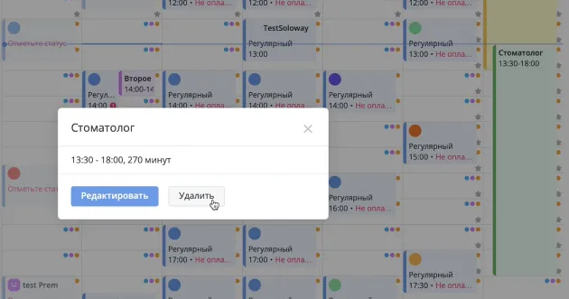
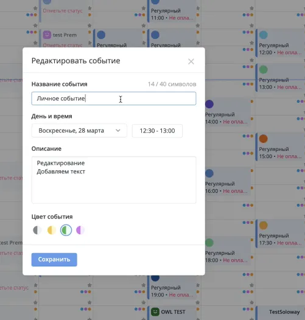
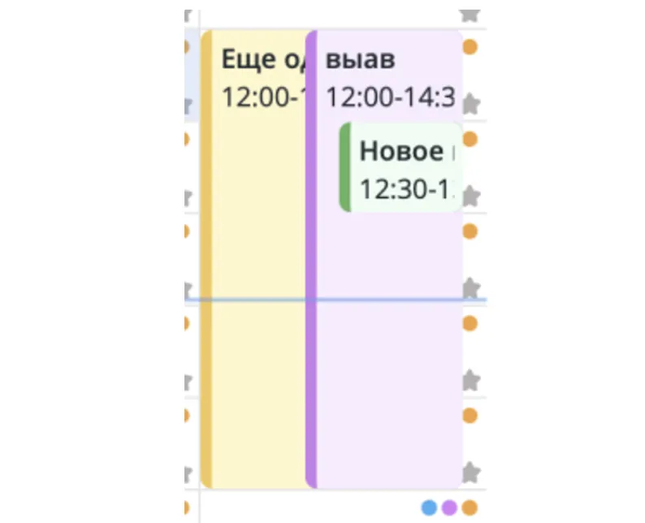

# Требования

Мы добавили в календарь новый элемент — личные события.

Преподаватель может использовать личные события для собственных встреч.

Они служат напоминанием, что у преподавателя что-то запланировано на это время.

## Операции с личными событиями

Добавление личных событий

Преподаватель может добавить личное событие двумя способами:

- кликнуть на слот,
- нажать на плюс.

### При добавлении личного события:

- Название — обязательный параметр, не длиннее 40 символов.
- Дата и время — обязательный параметр.
- Описание — необязательно для заполнения, нет ограничения по символам. На данном этапе нельзя вставлять картинки. Доступны маркдауны и ссылки.
- Цвет события — по умолчанию серый.

 

### Удаление личных событий

Для удаления личного события необходимо на него кликнуть и нажать кнопку «Удалить».

### Редактирование личных событий

Для того чтобы отредактировать личное событие, необходимо кликнуть на него и нажать «Редактировать».

При редактировании можно изменить:

- название,
- цвет,
- описание,
- время.

### Совмещение личного события и урока

Если событие и урок совпадают по времени, урок всегда отображается выше всего.

Если два события происходят в одно время, выше отображается то, которое было создано последним.

## Стейкхолдеры

Наши стейкхолдеры — это учителя с разными потребностями. Помимо стандартных часовых уроков с выбранными учениками, они заносят в расписание другие свои уроки как личные события:

### Марья Ивановна

Преподает сразу в нескольких школах (трех). Очень важно, чтобы в ее расписании она сразу могла увидеть наглядно, какой ученик из какой школы придет. Важной функциональностью является то, чтобы была возможность все события в календаре разделить по цветам — так ей будет достаточно просто ориентироваться в календаре.

### Анастасия Петровна

Обычно пользуется своим календарем. Поэтому в систему заносит все прошедшие события в конце месяца, чтобы ей начисляли за это заработную плату. Самый распространенный сценарий — создать все события за месяц уже в следующем месяце. Например, события, которые у нее были в январе, она будет заносить в систему только в феврале.

### Кирилл Егорович

Имеет очень много учеников, а также ведет множество предметов. Например, если он готовит ученика на олимпиаду, то ему нужно 2,5 часа на урок, а если это первоклассник — то 35 минут. Минимальный урок для него — 25-минутный по обществознанию, а вот максимальный — 9 часов 40 минут (готовил мальчика к олимпиаде).

 

##  Документация для API

###  Получение расписания 

POST запрос на URL - https://api-teachers.skyeng.ru/v2/schedule/events  

#### Тело запроса:

{ 

     "from": "2025-06-23T00:00:00+03:00",

     "onlyTypes": [],

     "till": "2025-06-30T00:00:00+03:00"

}

  

#### Тело ответа: 

{

    "data": {

        "events": [

            {

                "eventId": "S100937114-20250626-050000",

                "startAt": "2025-06-26T05:00:00+00:00",

                "durationSeconds": 1800,

                "type": "personal",

                "payload": {

                    "id": 100937114,

                    "createdAt": "2025-06-17T05:03:55+00:00",

                    "updatedAt": "2025-06-17T05:03:55+00:00",

                    "participants": [

                        {

                            "isPresenceConfirmed": null,

                            "wasPresent": null,

                            "role": "teacher",

                            "educationServiceId": null,

                            "isPresenceMandatory": false,

                            "class": "person",

                            "id": 14894250

                        }

                    ],

                    "stk": null,

                    "status": null,

                    "parentId": null,

                    "eventRegularId": null,

                    "deletedAt": null,

                    "payload": {

                        "color": "#81888D",

                        "title": "\u041d\u043e\u0432\u044b\u0439 \u0443\u0440\u043e\u043a",

                        "parentId": null,

                        "description": "\u0410\u043d\u0433\u043b\u0438\u0439\u0441\u043a\u0438\u0439 \u044f\u0437\u044b\u043a",

                        "backgroundColor": "#F4F5F6"

                    }

                }

            }

###  Создание личного события 

POST запрос на URL - https://api-teachers.skyeng.ru/v2/schedule/createPersonal  

#### Тело запроса:

{

    "backgroundColor": "#EBFDF2",

    "color": "#43B658",

    "description": "",

    "endAt": "2025-06-28T23:20:00+03:00",

    "startAt": "2025-06-28T23:10:00+03:00",

    "title": "test1"

  }

#### Тело ответа: 

{

    "data": {

        "eventId": "S100962619-20250628-201000",

        "startAt": "2025-06-28T20:10:00+00:00",

        "durationSeconds": 600,

        "type": "personal",

        "payload": {

            "id": 100962619,

            "createdAt": "2025-06-25T02:40:14+00:00",

            "updatedAt": "2025-06-25T02:40:14+00:00",

            "participants": [

                {

                    "isPresenceConfirmed": null,

                    "wasPresent": null,

                    "role": "teacher",

                    "educationServiceId": null,

                    "isPresenceMandatory": false,

                    "class": "person",

                    "id": 14894250

                }

            ],

            "stk": null,

            "status": null,

            "parentId": null,

            "eventRegularId": null,

            "deletedAt": null,

            "payload": {

                "color": "#43B658",

                "title": "test1",

                "parentId": null,

                "description": "",

                "backgroundColor": "#EBFDF2"

            }

        }

    },

    "errors": null,

    "meta": null

}

### Редактирование личного события   

POST запрос на URL - https://api-teachers.skyeng.ru/v2/schedule/updatePersonal

#### Тело запроса:

 { 

    "backgroundColor": "#FFF7C7",

    "color": "#FAC641",

    "description": "good",

    "endAt": "2025-06-28T23:30:00+03:00",

    "id": 100962619,

    "oldStartAt": "2025-06-28T23:10:00+03:00",

    "startAt": "2025-06-28T23:20:00+03:00",

    "title": "test1,02"

 }

 

#### Тело ответа: 

{

    "data": {

        "eventId": "S100962623-20250628-202000",

        "startAt": "2025-06-28T20:20:00+00:00",

        "durationSeconds": 600,

        "type": "personal",

        "payload": {

            "id": 100962623,

            "createdAt": "2025-06-25T02:46:53+00:00",

            "updatedAt": "2025-06-25T02:46:53+00:00",

            "participants": [

                {

                    "isPresenceConfirmed": null,

                    "wasPresent": null,

                    "role": "teacher",

                    "educationServiceId": null,

                    "isPresenceMandatory": false,

                    "class": "person",

                    "id": 14894250

                }

            ],

            "stk": null,

            "status": null,

            "parentId": 100962619,

            "eventRegularId": null,

            "deletedAt": null,

            "payload": {

                "color": "#FAC641",

                "title": "test1,02",

                "parentId": 100962619,

                "description": "good",

                "backgroundColor": "#FFF7C7"

            }

        }

    },

    "errors": null,

    "meta": null

}

### Удаление личного события  

POST запрос на URL - https://api-teachers.skyeng.ru/v2/schedule/removePersonal  

#### Тело запроса:

  {

    "id": 100962623,

    "startAt": "2025-06-28T23:20:00+03:00"

 }

 

#### Тело ответа: 

{

    "data":true,

    "errors":null,

    "meta":null

}

